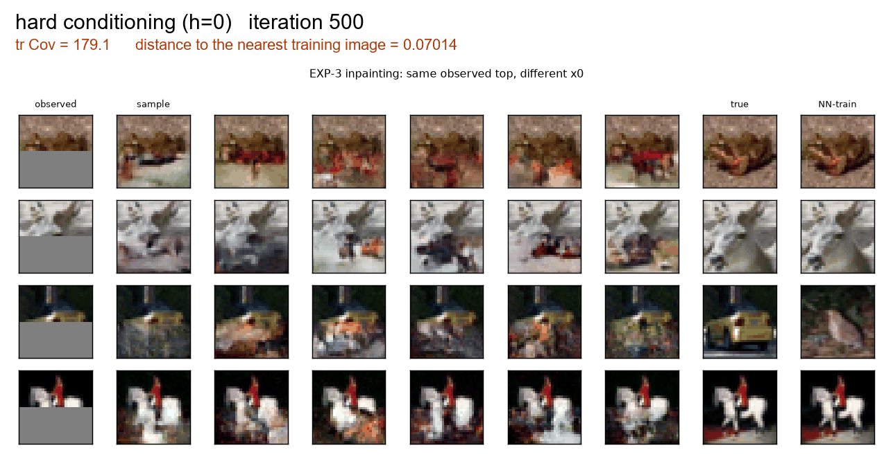
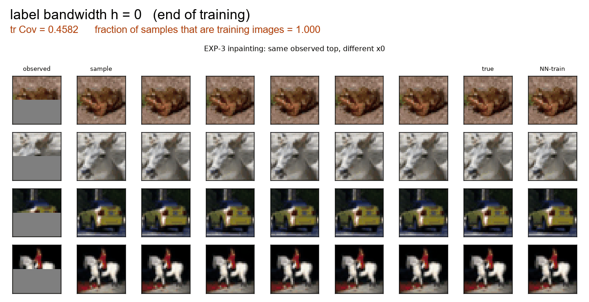
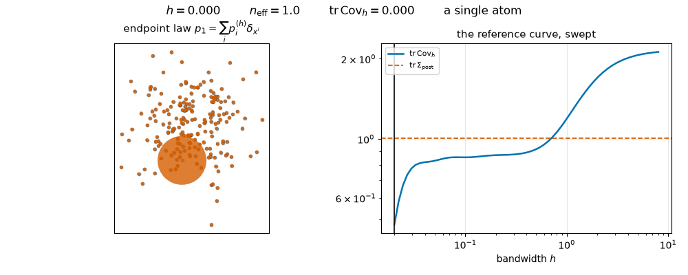
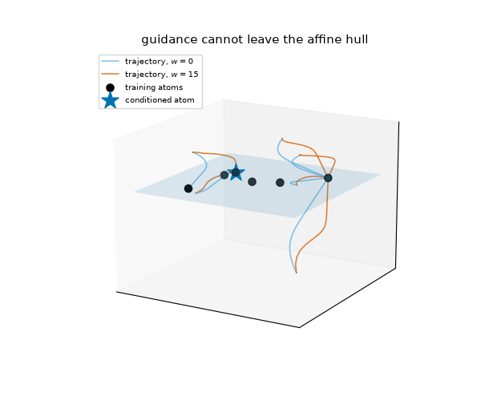
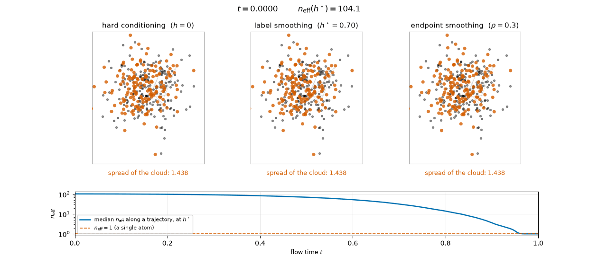

# Posterior Variance Collapse in Conditional Flow Matching

Numerical verification of a theorem about **posterior variance collapse** in
conditional flow matching (CFM). This is a *theory-verification* project, not a
benchmark chase — see `docs/THEORY.md` for the complete, self-contained proofs
(every proposition proved, no hanging assumptions), `WORK_ORDER.md` for the task
plan, `PROJECT_SPEC_conditional_fm_collapse.md` for the original specification,
and `results/RESULTS.md` for the findings.

**Central claim.** In conditional CFM with a deterministic linear interpolant,
the "resample `x0` every step" mechanism that protects *unconditional* CFM from
memorization is defeated, because the condition `y` acts as an identifier of the
training sample. The minimizer collapses to

```
v*(x, t, y^i) = (x^i - x) / (1 - t)          (★)
```

whose flow maps every source `x0` to the single training point `x^i`, so the
generated posterior has **zero variance**.

## The result, in four animations

**The collapse, on real photographs.** Six completions of the same masked image at
successive training iterations. They start visibly different and end pixel-identical
-- and identical to one specific training image, shown in the last column. Measured
`tr Cov` falls 179.1 -> 0.431 across these frames.



**The remedy, and its ceiling.** The same conditions at the end of training, swept
over the label bandwidth. Diversity comes back as `h` grows -- which is what any
diversity metric would reward -- while the fraction of samples that are still
training images stays high. At `h = 5` the completions are wildly varied and 72% of
them are training photographs, several of which do not even match the visible half.
Restored variance, un-restored posterior.



**The whole family in one sweep.** On the 2-d instance, the exact endpoint law as `h`
runs from 0 upward: a single point mass, then a kernel-weighted mixture that passes
exactly through `tr Cov_h = tr Sigma_post`, then the uniform empirical measure. The
two corollaries of the paper are the two ends of this animation.



**Guidance cannot leave the training set.** Atoms spanning a plane in R^3, with
trajectories started deliberately off it. Whatever the guidance weight, they are
pulled onto the plane, because the component orthogonal to it obeys `q_t = (1-t) q_0`
exactly. When `N <= d` that plane is a null set, so no guidance weight makes the
conditional law continuous.



Regenerate any of them with
`uv run python -m scripts.make_project_animations --only NAME`.

## The mechanism, in one animation



Three exact population flows on the same problem, from the same source draws. Left:
hard conditioning, where every trajectory lands on one training image and the cloud's
spread ends at 0.001. Middle: label smoothing at the bandwidth where `tr Cov_h` equals
`tr Sigma_post` exactly, so the spread ends at 1.055 against a target of 1.002 -- the
right variance, on the same finite set of atoms. Right: endpoint smoothing, the only
one of the three whose support leaves the training set.

The strip underneath is what is actually collapsing: the effective number of atoms the
flow is choosing between stays near 100 for most of the clock and falls to 1 only in
the last few percent, which is why collapse looks abrupt.

Regenerate with `uv run python -m scripts.make_collapse_animation`.

## Setup

This repo uses [`uv`](https://docs.astral.sh/uv/). Torch is pinned to the CPU
wheels (EXP-1/EXP-2 run comfortably on CPU).

```bash
uv sync
```

### Windows note (MSVC runtime)

The PyTorch CPU wheels need the Microsoft Visual C++ runtime DLLs. If you see
`OSError: [WinError 126] ... c10.dll`, install the runtime DLLs into the venv
(no admin required):

```bash
uv pip install msvc-runtime
```

(Or install the system-wide VC++ redistributable from https://aka.ms/vs/17/release/vc_redist.x64.exe.)
PyTorch prints a "Redistributable is not installed" *warning* even after this
works — it is a static check and can be ignored once imports succeed.

## Running EXP-1 (Linear-Gaussian)

Fast pipeline check (< 2 min):

```bash
uv run python -m src.train --config configs/exp1_linear_gaussian.yaml --smoke-test
```

Full conditional run (overtraining to 200k iters is the *object of study*):

```bash
uv run python -m src.train --config configs/exp1_linear_gaussian.yaml \
    --set run_name=exp1_cond_seed0 seed=0 model.conditional=true
```

Unconditional baseline (P4):

```bash
uv run python -m src.train --config configs/exp1_linear_gaussian.yaml \
    --set run_name=exp1_uncond_seed0 seed=0 model.conditional=false
```

Aggregate seeds and render the core P1/P2/P3/P4 figures:

```bash
uv run python scripts/analyze_exp1.py \
    --cond "results/exp1/exp1_cond_seed*" \
    --uncond "results/exp1/exp1_uncond_seed*" \
    --out results/exp1/_analysis
```

The full multi-seed protocol is scripted in `scripts/run_exp1.ps1` (Windows) and
`scripts/run_exp1.sh` (POSIX).

### Adversarial-pairing ablation

Does collapse need a *real* posterior, or just distinct labels? Shuffle `Y` relative
to `X` (`data.shuffle_labels: true`) and re-run the same architecture/schedule; the
theory (Proposition 4) predicts collapse to the *assigned* `x^i` either way, since it
never uses the forward operator, only label distinctness:

```bash
uv run python -m src.train --config configs/exp1_adversarial_shuffle.yaml \
    --set run_name=exp1_adv_shuffle_seed0 seed=0
uv run python scripts/analyze_exp1_adversarial.py \
    --real "results/exp1/exp1_cond_seed[0-4]" \
    --shuffled "results/exp1/exp1_adv_shuffle_seed*" \
    --out results/exp1/_analysis_adversarial
```

Full 3-seed protocol: `scripts/run_exp1_adversarial.{sh,ps1}` (~18 min/seed on CPU,
no GPU needed). See `results/RESULTS.md` §"Adversarial pairing" for results.

## Phase B — sweeps and remedies (EXP-1) + EXP-2

Parameter sweeps (P5 σ_obs, P6 N, P7 y-noise vs interpolant-noise remedy, d/k)
run in parallel with a concurrency limit:

```bash
uv run python scripts/run_sweeps.py --workers 5 --threads 5 --iters 200000
uv run python scripts/analyze_sweeps.py --root results/exp1 --out results/exp1/_sweeps
```

EXP-2 (Gaussian-mixture posterior, selective memorization / mode coverage):

```bash
uv run python -m src.train_exp2 --config configs/exp2_gmm.yaml --smoke-test
uv run python -m src.train_exp2 --config configs/exp2_gmm.yaml --set run_name=exp2_gmm_seed0 seed=0
uv run python scripts/analyze_exp2.py --runs "results/exp2/exp2_gmm_seed*" --out results/exp2/_analysis
uv run python scripts/visualize_gmm_2d.py --run results/exp2/exp2_gmm_seed0 --early 1000 --late 200000
```

## Phase C — EXP-3 (MNIST inpainting, qualitative)

Needs `torchvision` (installed by `uv sync`; MNIST auto-downloads to `data/`).

```bash
uv run python -m src.train_exp3 --config configs/exp3_inpainting.yaml --smoke-test
uv run python -m src.train_exp3 --config configs/exp3_inpainting.yaml \
    --set run_name=exp3_mnist_seed0 seed=0 train.max_iters=15000
uv run python scripts/analyze_exp3.py --run results/exp3/exp3_mnist_seed0
```

Per-checkpoint sample grids (same observed top, different `x0`, next to the true
and nearest-neighbour training image) are saved under the run's `figures/`.

## Layout

```
src/
  problems/linear_gaussian.py   forward model + closed-form posterior
  models/mlp_velocity.py        MLP velocity field + sinusoidal time embedding
  flows/interpolants.py         deterministic + stochastic interpolant, eq. (★)
  flows/cfm.py                  CFM loss (conditional & unconditional)
  flows/ode_solver.py           Euler / RK4 sampler, t=1 singularity handling
  metrics/                      posterior stats [P1/P3], velocity error [P2], MMD/Sinkhorn
  train.py                      training + checkpoint evaluation driver
configs/                        YAML configs (CLI overridable via --set a.b=c)
scripts/                        analysis + orchestration
results/                        figures, raw CSVs, RESULTS.md
```

## Predictions under test (spec Section 2.3)

| ID | Prediction |
|----|------------|
| P1 | generated variance → 0 with overtraining |
| P2 | learned velocity → closed form (★) |
| P3 | generated samples collapse onto the true training point `x^i` |
| P4 | collapse is far weaker / absent for unconditional CFM |
| P5 | collapse weakens as `y^i` get closer (larger `σ_obs`) |
| P6 | collapse weakens as `N` grows at fixed capacity |
| P7 | smoothing the **condition** `y` restores variance (remedy) |
