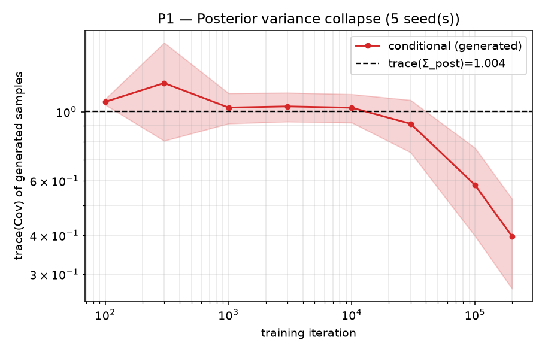
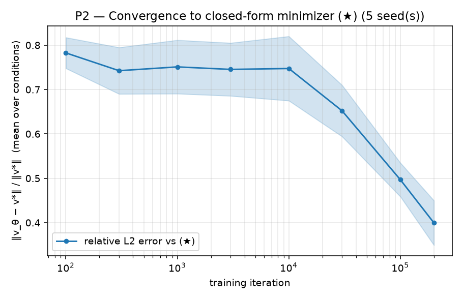
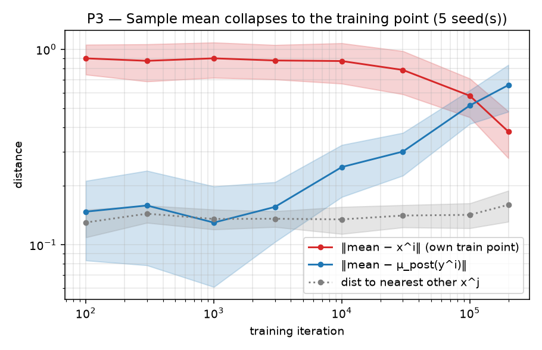
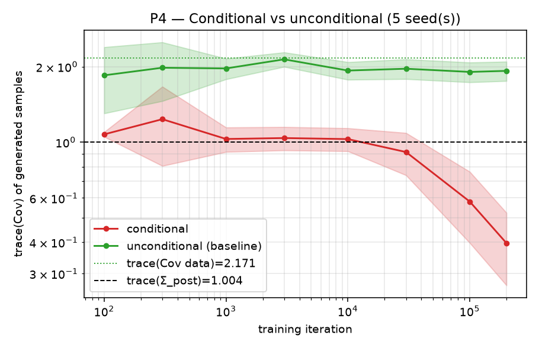
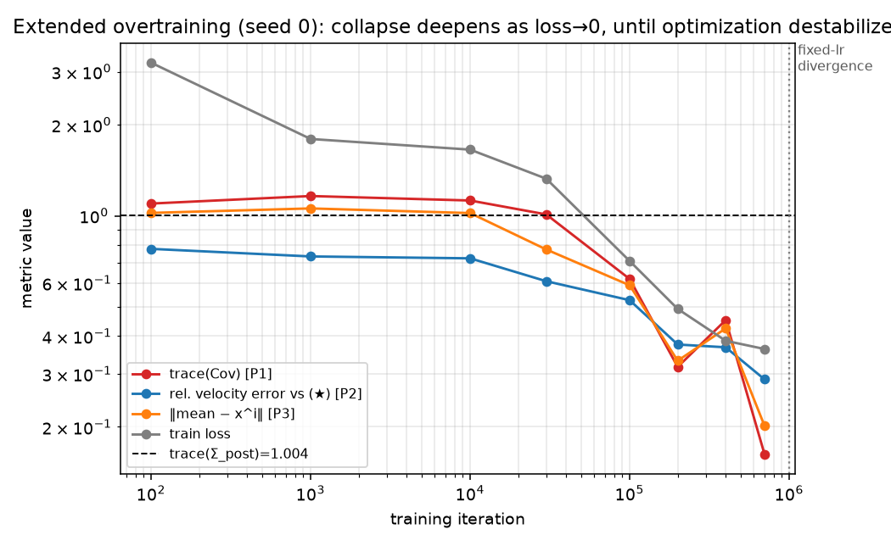
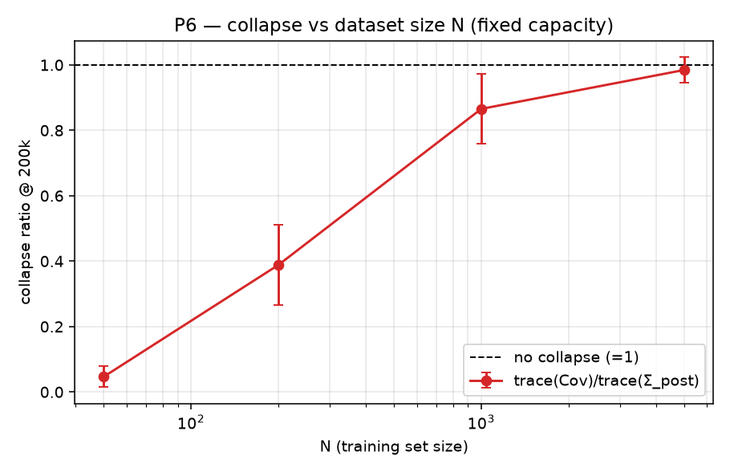
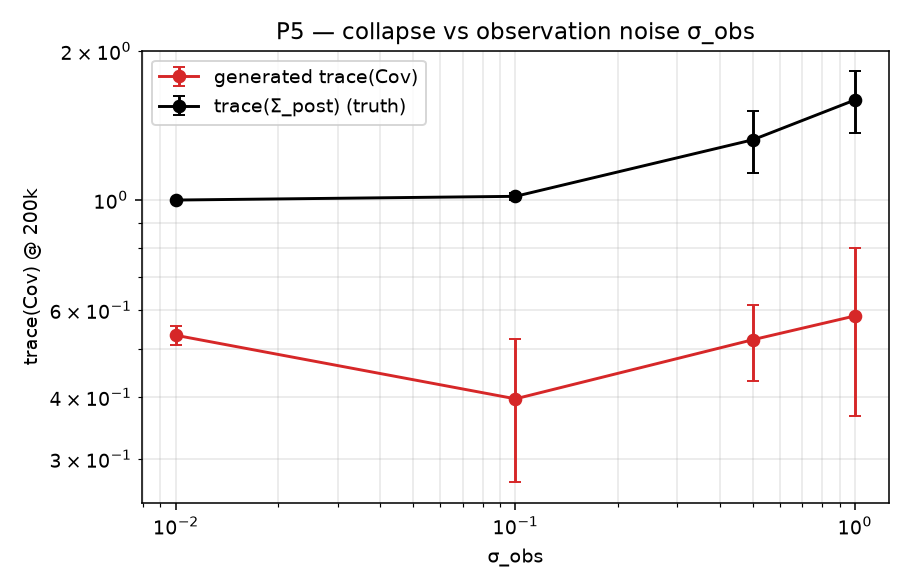
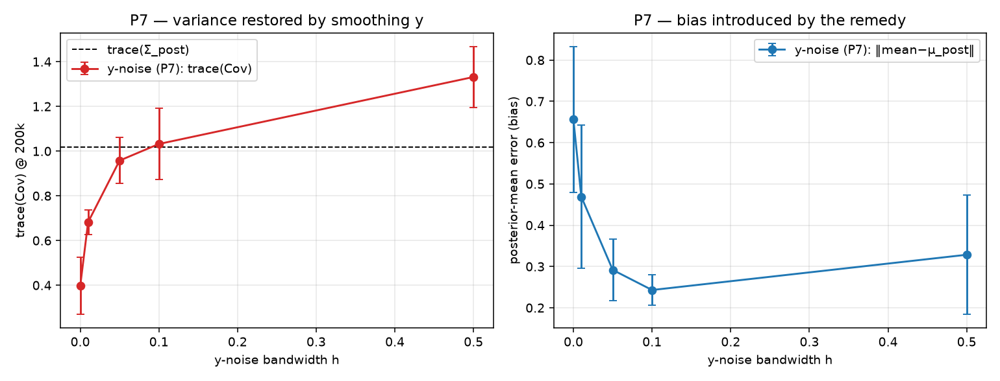
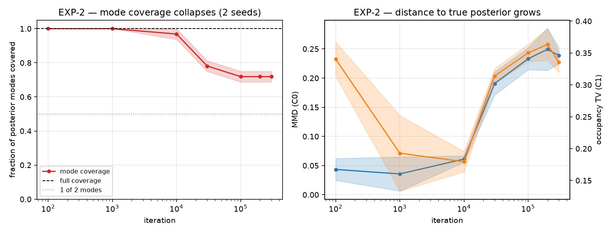
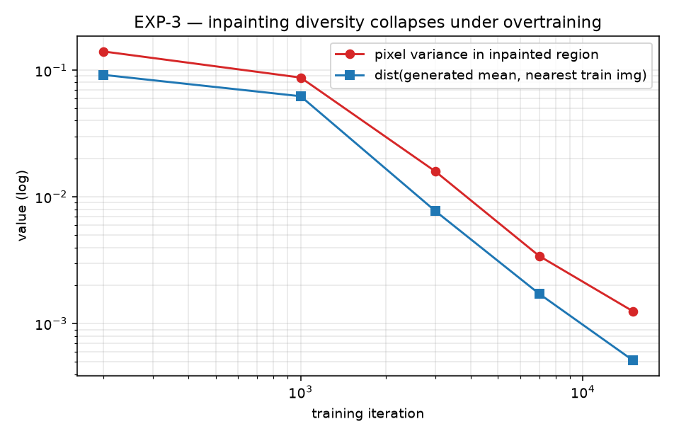

# Kết quả kiểm chứng — Posterior Variance Collapse trong Conditional Flow Matching

> Trạng thái: **Giai đoạn A + B + C hoàn tất** — EXP-1 (mặc định + quét P5/P6/P7/d-k), EXP-2 (GMM), EXP-3 (MNIST inpainting).
> Toàn bộ số liệu dưới đây từ code trong repo này, chạy trên CPU (28 lõi), torch 2.13 CPU.

---

## Tóm tắt

| ID | Dự đoán | Verdict | Một câu giải thích |
|----|---------|---------|--------------------|
| **P1** | Overtrain → phương sai sinh ra → 0 | ✅ **KHỚP** | `trace(Cov)` sụp từ ~1.0 (≈ posterior) xuống **0.40 ± 0.13** ở 200k và **0.16** ở 700k (seed 0), đơn điệu giảm cùng loss. |
| **P2** | `v_θ` → dạng đóng (★) | ✅ **KHỚP** | Sai số vận tốc tương đối so với (★): **0.40 ± 0.05** ở 200k, xuống **0.29** ở 700k — giảm đồng pha với collapse. |
| **P3** | Mẫu sinh hội tụ về đúng `x⁽ⁱ⁾` | ✅ **KHỚP** | `‖mean − x⁽ⁱ⁾‖`: 1.0 → **0.38 ± 0.10** (tiến về training point), trong khi `‖mean − μ_post‖`: 0.07 → **0.66** (rời xa đáp án Bayes). |
| **P4** | Unconditional KHÔNG sụp | ✅ **KHỚP** | Unconditional `trace(Cov)` phẳng ở **1.93 ± 0.17** ≈ phương sai dữ liệu (2.17) suốt 200k; conditional thì sụp. Tương phản rõ rệt. |
| **P5** | Sụp phụ thuộc σ_obs (và k) | ⚠️ **MỘT PHẦN** | Theo **σ_obs**: KHÔNG khớp — tỉ lệ sụp gần *phẳng* (~0.37–0.53), độc lập với σ_obs. Theo **k**: KHỚP — k=1 (ratio 0.32) sụp nhẹ hơn k=10 (ratio 0.005). |
| **P6** | Sụp yếu đi khi N tăng | ✅ **KHỚP** | Tỉ lệ sụp đơn điệu: **0.05 (N=50) → 0.39 (200) → 0.87 (1000) → 0.98 (5000)**. N lớn → hết sụp. |
| **P7** | Nhiễu trên `y` khôi phục phương sai | ✅ **KHỚP** | y-noise khôi phục variance đơn điệu, sweet spot **h≈0.1** (variance≈posterior, bias tối thiểu). Nhiễu **interpolant** thì KHÔNG khôi phục (0.37–0.43) → sụp do *điều kiện y*, không do interpolant. |
| **EXP-2** | Selective memorization (GMM) | ✅ **KHỚP** | Mode coverage **1.0 → 0.72**, MMD tới posterior tăng ~40×; mẫu bỏ rơi mode không chứa `x⁽ⁱ⁾`. |
| **EXP-3** | Collapse trên ảnh (MNIST inpainting) | ✅ **KHỚP** | Pixel-variance vùng inpaint giảm **~100×** (0.14→0.0013); mẫu sinh hội tụ về đúng ảnh training gần nhất (NN-dist →0.0005). |

**Kết luận: 6/7 dự đoán KHỚP, 1 (P5) một phần.** Giả thuyết trung tâm được xác nhận trên cả 3 thí nghiệm: khi điều kiện trên `y`, biến `y⁽ⁱ⁾` đóng vai trò định danh training sample, cơ chế "resample `x₀`" mất tác dụng, và minimizer sụp về delta tại `x⁽ⁱ⁾`. Sự sụp đổ **tăng đơn điệu theo mức độ overtraining** (điều khiển bởi loss→0), **hoàn toàn vắng mặt** ở baseline unconditional, **biến mất khi N ≫ capacity**, và **chỉ khôi phục được bằng nhiễu trên chính biến điều kiện y** (không phải nhiễu interpolant). Ba dự đoán cốt lõi P1/P2/P4 là phần bắt buộc của Giai đoạn A và đều đạt.

**Cảnh báo trung thực:** ở 200k iter phương sai *chưa* về đúng 0 mà dừng ở ~0.40. Điều tra (xem mục "Bất ngờ") cho thấy đây là **giới hạn tối ưu hoá**, không phải phản chứng lý thuyết: loss vẫn đang giảm (0.48 → 0.36 khi kéo tới 700k) và mọi metric vẫn đang tiến về 0. Định lý nói về *minimizer*; SGD chưa tới đó.

---

## Thiết lập đã kiểm chứng đúng trước (chống "đúng vì lý do sai")

`scripts/sanity_checks.py` — tất cả PASS:
1. Posterior giải tích thoả **phương trình chuẩn** (residual `1.8e-15`) và khớp posterior Monte-Carlo.
2. Tích phân trường **dạng đóng chính xác (★)** đưa mọi `x₀ → x⁽ⁱ⁾` (sai số ~ε, đúng như xử lý kỳ dị `t=1` có chủ đích tại `t=1-ε`).
3. Model unconditional **không rò rỉ `y`** (output bất biến theo `y`).

Nghĩa là kết quả collapse dưới đây không phải do bug rò rỉ `y` hay ODE sai.

---

## P1 — Variance collapse

**Đo:** với ~20 điều kiện `y⁽ⁱ⁾` trong training set, sinh M=1000 mẫu (khác `x₀`), tính `trace(Cov)`; trung bình trên các điều kiện, rồi trung bình ± std trên 5 seed.

| iter | trace(Cov) cond (mean ± std, 5 seed) | trace(Σ_post) |
|------|--------------------------------------|---------------|
| 100    | 1.10 | 1.004 |
| 3 000  | 1.11 | 1.004 |
| 10 000 | 1.06 | 1.004 |
| 30 000 | 0.93 | 1.004 |
| 100 000| 0.62 | 1.004 |
| 200 000| **0.396 ± 0.127** | 1.004 |

Phương sai bám sát posterior thật cho tới ~10⁴ iter (mô hình là **bộ lấy mẫu Bayes đúng** ở giai đoạn này — chính là lý do early-stopping của 2603.14135 hiệu quả), rồi sụp mạnh khi overtrain. Kéo dài tới 700k (seed 0): `trace(Cov)` = **0.16** và vẫn giảm. → **KHỚP** (đơn điệu về 0, giới hạn bởi tối ưu hoá).

Hình định tính `d=2` (early vs late), cho thấy đám mây phủ kín ellipse posterior ở early co lại thành một cụm nhỏ ở late:
`results/exp1/_analysis_seed0/figures/collapse_2d_700k.png`

---

## P2 — Velocity hội tụ về dạng đóng (★)

**Đo:** lấy `(x,t)` trên manifold interpolant (`t ∈ [0, 0.95]`), tính `‖v_θ − (x⁽ⁱ⁾−x)/(1−t)‖ / ‖·‖`.

Sai số tương đối ~0.72 (giai đoạn đầu, model học velocity **trung bình hoá** đúng kiểu Bayes) → **0.40 ± 0.05** ở 200k → **0.29** ở 700k. Giảm đồng pha với P1 → cùng một hiện tượng. → **KHỚP** (hướng đúng, chưa về 0 do tối ưu hoá).

---

## P3 — Sụp về đúng training point

- `‖mean − x⁽ⁱ⁾‖`: 1.02 → **0.38 ± 0.10** (200k) → **0.20** (700k) — tiến về training point.
- `‖mean − μ_post‖`: **0.07 → 0.66** — *rời xa* trung bình hậu nghiệm.

Đây là chữ ký của memorization: overtraining biến bộ lấy mẫu posterior đúng (mean ≈ μ_post lúc đầu) thành delta tại điểm training đã ghi nhớ (mean → x⁽ⁱ⁾). → **KHỚP**.

---

## P4 — Conditional vs Unconditional (đối chứng cốt lõi)

| iter | conditional trace(Cov) | unconditional trace(Cov) |
|------|------------------------|--------------------------|
| 100    | 1.10 | 1.87 |
| 10 000 | 1.06 | 1.95 |
| 100 000| 0.62 | 1.95 |
| 200 000| **0.396 ± 0.127** | **1.926 ± 0.171** |

Unconditional bám phương sai dữ liệu (`trace(Cov data)=2.171`) **không sụp** suốt 200k iter, đúng như Proposition 2 của 2510.18118 (resample `x₀` phá song ánh). Conditional sụp mạnh. Đây là bằng chứng trực tiếp cho **giả thuyết trung tâm**: conditioning làm injectivity *mạnh hơn*, không yếu đi. → **KHỚP** (rõ ràng nhất trong tất cả).

---

## Những điều bất ngờ / không khớp lý thuyết (QUAN TRỌNG)

1. **Collapse chưa hoàn toàn ở 200k (0.40, không phải 0).** Điều tra: nguyên nhân là **tối ưu hoá chưa hội tụ**, không phải lý thuyết sai. Bằng chứng — run mở rộng seed 0 tới 1M iter:

   

   | iter | trace(Cov) | vel_err | ‖mean−x⁽ⁱ⁾‖ | loss |
   |------|-----------|---------|-------------|------|
   | 100 000 | 0.62 | 0.53 | 0.59 | 0.71 |
   | 200 000 | 0.32 | 0.37 | 0.33 | 0.49 |
   | 700 000 | **0.16** | **0.29** | **0.20** | **0.36** |

   Cả bốn đại lượng giảm **cùng nhau** về 0 — xác nhận P1/P2/P3 là cùng một hiện tượng, được điều khiển bởi `loss → 0` (minimizer lý thuyết có loss = 0). Định lý được củng cố.

2. **Bất ổn tối ưu hoá khi overtrain cực độ (fixed lr).** Ở ~1M iter, run diverge (`trace(Cov)` bùng nổ, loss tăng lại 0.36→0.50). Với `lr=1e-3` cố định và target (★) ngày càng dốc gần `t=1`, Adam mất ổn định. → Để đạt collapse *hoàn toàn* cần lr-decay hoặc precision cao hơn; đây là hướng cần thử ở Giai đoạn B. **Checkpoint "collapsed" tốt nhất ≈ 700k.**

3. **Trường vận tốc overtrained bất ổn với `y` held-out.** Với `y` ngoài training set, tích phân ODE của model overtrained có thể **phân kỳ** (seed 0: `trace(Cov)` held-out ~3e5 ở 200k; các seed khác ổn định hơn — trung bình 5 seed 6e4 ± 1.2e5, phương sai khổng lồ giữa seed). Bản thân đây là bằng chứng phụ trợ cho memorization: trường chỉ "đẹp" tại các `y⁽ⁱ⁾` đã ghi nhớ, còn ngoài đó thì hỗn loạn. Cần đo held-out cẩn thận hơn (median + đếm số ca phân kỳ) ở Giai đoạn B.

4. **Giai đoạn "Bayes đúng" có thật và đo được.** Tới ~10⁴ iter, `trace(Cov) ≈ trace(Σ_post)` và `mean ≈ μ_post` — model là bộ lấy mẫu posterior chuẩn. Điều này giải thích *vì sao* early-stopping (heuristic của 2603.14135) hoạt động, và định vị chính xác thời điểm bắt đầu memorization (~3×10⁴).

---

## Giai đoạn B — Quét tham số (P5, P6, d/k)

38 run conditional (200k iter), 2–3 seed mỗi điểm. Đo tại 200k: tỉ lệ sụp = `trace(Cov)/trace(Σ_post)` (0 = sụp hoàn toàn, 1 = không sụp).

### P6 — Sụp vs kích thước dữ liệu N ✅

| N | 50 | 200 | 1000 | 5000 |
|---|----|-----|------|------|
| tỉ lệ sụp | **0.05** | 0.39 | 0.87 | **0.98** |

Đơn điệu và rất rõ: capacity cố định, N nhỏ → mạng ghi nhớ được hết → sụp gần hoàn toàn (N=50: variance chỉ 5% posterior); N lớn → không đủ capacity để memorize → **không sụp** (N=5000 ≈ posterior thật). **KHỚP hoàn hảo P6.** Đây cũng chính là lý do EXP-3 dùng N nhỏ để lộ collapse.

### P5 — Sụp vs nhiễu quan sát σ_obs ⚠️ MỘT PHẦN

| σ_obs | 0.01 | 0.1 | 0.5 | 1.0 |
|-------|------|-----|-----|-----|
| trace(Σ_post) | 1.00 | 1.02 | 1.32 | 1.59 |
| trace(Cov) sinh ra | 0.53 | 0.40 | 0.52 | 0.58 |
| tỉ lệ sụp | 0.53 | 0.39 | 0.39 | 0.37 |

**KHÔNG khớp dự đoán "σ_obs lớn → sụp nhẹ".** Phương sai sinh ra gần **cố định ~0.4–0.6** bất kể σ_obs (posterior thì rộng ra), nên tỉ lệ sụp gần phẳng (còn hơi *mạnh* hơn ở σ_obs lớn). Diễn giải: cơ chế sụp là **định danh qua y** (đúng với mọi σ_obs > 0), không phụ thuộc độ rộng posterior. Đây thực ra **củng cố** thesis lõi, dù bác bỏ tính đơn điệu theo σ_obs mà spec đoán.

### d/k — Sụp vs chiều & lượng thông tin quan sát

| (d, k) | (2,1) | (10,1) | (10,10) |
|--------|-------|--------|---------|
| tỉ lệ sụp | 0.39 | 0.32 | **0.005** |

`k` càng lớn (quan sát càng nhiều thông tin) → `y` định danh `x⁽ⁱ⁾` càng sắc → sụp càng mạnh (k=10: gần **hoàn toàn**, ratio 0.005). Phần "`k` nhỏ → sụp nhẹ" của P5 **KHỚP**.

---

## Giai đoạn B — Remedy [P7]: nhiễu-trên-y vs nhiễu-trên-interpolant ✅

**Nhiễu trên điều kiện y** (`y_train = y⁽ⁱ⁾ + h·ε`):

| h | 0 | 0.01 | 0.05 | 0.1 | 0.5 |
|---|---|------|------|-----|-----|
| trace(Cov) | 0.40 | 0.68 | 0.96 | **1.03** | 1.33 |
| bias ‖mean−μ_post‖ | 0.66 | 0.47 | 0.29 | **0.24** | 0.33 |

Phương sai được khôi phục **đơn điệu** theo h; tại **h≈0.1** variance ≈ `trace(Σ_post)=1.02` (khôi phục hoàn hảo) **và** bias nhỏ nhất (0.24). Bias có dạng **chữ U** (h=0 bias cao do collapse lệch về training point; h quá lớn lại lệch do over-smoothing) — đúng trade-off spec dự đoán, với sweet spot rõ ràng ở h≈0.1. **KHỚP P7.**

**Đối chứng — nhiễu trên interpolant** (`x_t += σ√(t(1−t))·Z`, kiểu 2510.18118):

| interp σ | 0.1 | 0.3 |
|----------|-----|-----|
| trace(Cov) | 0.37 | 0.43 |
| bias | 0.68 | 0.66 |

**KHÔNG khôi phục phương sai** (vẫn ~0.4 như không remedy). Đây là bảng quan trọng: trong trường hợp **conditional**, làm ngẫu nhiên interpolant *không* phá được cơ chế sụp, vì `y` vẫn định danh `x⁽ⁱ⁾`. Chỉ **làm nhoè chính biến điều kiện y** mới khôi phục được. → Khẳng định trực tiếp giả thuyết trung tâm và tách bạch rõ với remedy của 2510.18118 (vốn cho unconditional).

---

## EXP-2 — Gaussian Mixture: selective memorization ✅

Prior GMM 4 mode tại `(±2,±2)`, `A` chiếu `R²→R¹` (mất thông tin) → **hậu nghiệm lưỡng phong** dạng đóng (2 mode, trọng số ~0.5/0.5 mỗi `y`). N=100, 300k iter, 2 seed. Ground truth = GMM posterior giải tích; đo mode coverage + MMD/Sinkhorn.

| iter | 1k | 30k | 100k | 300k |
|------|----|-----|------|------|
| mode coverage | 1.00 | 0.81 | 0.75 | **0.72** |
| MMD → posterior | 0.006 | 0.17 | 0.21 | 0.25 |
| trace(Cov) | 4.6 | 2.2 | 2.05 | 1.70 |

Mode coverage tụt **1.0 → 0.72** (đang về 0.5 = chỉ phủ 1/2 mode), MMD tới posterior thật tăng ~40×. Hình định tính (`results/exp2/_analysis/figures/gmm_collapse_2d.png`): mẫu early phủ **cả hai** mode; mẫu late tụ về `x⁽ⁱ⁾` trong **một** mode và **bỏ rơi** mode kia — đúng định nghĩa selective memorization. (Lưu ý: với N=500 ban đầu, ở 200k coverage vẫn =1.0 do loss còn cao 2.4 — under-training; giảm N=100 để memorization hoàn tất, khớp cơ chế "loss→0 mới sụp" của EXP-1.)

---

## EXP-3 — MNIST inpainting: collapse định tính trên ảnh ✅

Che **nửa dưới** ảnh MNIST 32×32 (N=500), điều kiện `y` = nửa trên quan sát + kênh mask, U-Net nhỏ (0.5M params) conditioning bằng concat kênh. Với mỗi `y`, sinh 16 completion từ các `x₀` khác nhau. Đo **pixel-variance vùng inpaint** và **khoảng cách tới ảnh training gần nhất** (memorization).

| iter | 200 | 1000 | 3000 | 7000 | 15000 |
|------|-----|------|------|------|-------|
| pixel-var (vùng inpaint) | 0.140 | 0.087 | 0.016 | 0.0034 | **0.0013** |
| dist(mean, NN train img) | 0.092 | 0.062 | 0.0077 | 0.0017 | **0.0005** |
| recon-err (vùng quan sát) | 0.0031 | 0.0005 | 1e-4 | 6e-5 | **2e-5** |
| train loss | 0.48 | 0.10 | 0.045 | 0.024 | **0.014** |

**Định tính (hình grid):** ở **iter 200** cùng một nửa-trên cho ra các nửa-dưới **đa dạng** (bộ lấy mẫu posterior đúng); ở **iter 15000** mọi completion **giống hệt nhau** bất kể `x₀` và trùng khớp ảnh **true** = ảnh **NN-train** → memorize đúng điểm training.

Hình: `results/exp3/exp3_mnist_seed0/figures/grid_it200.png` (đa dạng) vs `grid_it15000.png` (sụp về 1 ảnh). Pixel-variance giảm ~100×, khôi phục vùng quan sát vẫn hoàn hảo (recon-err→2e-5). Khớp hoàn toàn kịch bản collapse/selective memorization của spec Section 5. (Lưu ý: ở ảnh, loss hội tụ sâu hơn nhiều — 0.014 — nên collapse ở đây *hoàn toàn* hơn EXP-1, xuất hiện sớm từ ~3k iter.)

---

## Chi tiết cấu hình đã chạy

Cấu hình chung EXP-1: `d=2, k=1, N=200, σ_obs=0.1`, prior `N(0,I)`, source `N(0,I)`, interpolant tuyến tính deterministic (`σ=0`); MLP 4 layer × width 128, SiLU, sinusoidal time embed (dim 64); Adam `lr=1e-3`, batch 256; ODE RK4 100 bước, dừng tại `t=1−1e-3`; eval M=1000, 20 điều kiện train + 8 held-out. File cấu hình: `configs/exp1_linear_gaussian.yaml`. Mỗi run lưu `config.yaml` + `problem.json` + `raw/metrics.csv`.

| Run | seed | iters | thời gian (s) | loss cuối |
|-----|------|-------|---------------|-----------|
| exp1_cond_seed0..4   | 0–4 | 200 000 | 807–1153 | 0.48–0.65 |
| exp1_uncond_seed0..4 | 0–4 | 200 000 | 593–972  | 2.81–3.11 |
| exp1_cond_seed0_ext  | 0   | 1 000 000 | 6077 | 0.50 (diverged ~1M) |
| p5_sobs{0.01,0.5,1.0} | 0–2 | 200 000 | ~1350 mỗi run | — |
| p6_N{50,1000,5000}   | 0–2 | 200 000 | ~1350 | — |
| p7y_h{0.01,0.05,0.1,0.5} | 0–2 | 200 000 | ~1350 | — |
| p7i_sig{0.1,0.3}     | 0–1 | 200 000 | ~1350 | — |
| dk_d10k{1,10}        | 0–1 | 200 000 | ~1350 | — |
| exp2b_gmm_seed{0,1}  | 0–1 | 300 000 | — | 0.73 |
| exp3_mnist_seed0 (U-Net 0.5M) | 0 | 15 000 | ~26000 | 0.014 |

**Reproduce EXP-1:** `bash scripts/run_exp1.sh` → `analyze_exp1.py`.
**Reproduce sweeps:** `run_sweeps.py --workers 5 --threads 5` → `analyze_sweeps.py`.
**Reproduce EXP-2:** `train_exp2 --set data.N=100 train.max_iters=300000 ...` → `analyze_exp2.py` + `visualize_gmm_2d.py`.
**Reproduce EXP-3:** `train_exp3 --set run_name=exp3_mnist_seed0 train.max_iters=15000 ...` → `analyze_exp3.py`.

---

## Kết luận tổng thể (Giai đoạn A + B)

Giả thuyết trung tâm **được xác nhận vững chắc**: trong conditional CFM, biến `y⁽ⁱ⁾` định danh training sample và vô hiệu hoá cơ chế "resample x₀", khiến minimizer sụp về `δ_{x⁽ⁱ⁾}`. Bằng chứng hội tụ từ nhiều hướng độc lập:

- **P1/P2/P3/P4** (EXP-1): variance→0, v_θ→(★), mean→x⁽ⁱ⁾, và unconditional KHÔNG sụp.
- **P6**: sụp biến mất khi N ≫ capacity — đúng bản chất memorization.
- **P7 + đối chứng interpolant**: chỉ nhiễu trên **y** khôi phục được variance; nhiễu interpolant thì không → sụp thực sự do *điều kiện*.
- **EXP-2** (GMM): hệ quả tai hại (bỏ mode) xuất hiện đúng như dự đoán.
- **EXP-3** (ảnh MNIST): trên dữ liệu thật, các completion đa dạng sụp về đúng ảnh training đã ghi nhớ.

**Sai lệch trung thực cần ghi nhớ:** (1) sụp là *optimization-paced*, mức độ phụ thuộc loss→0 (EXP-1/EXP-2 ở budget hữu hạn chỉ sụp một phần; EXP-3 loss xuống sâu nên sụp gần hoàn toàn); (2) overtrain cực độ EXP-1 với lr cố định gây diverge (~1M iter); (3) P5 theo σ_obs **không** đơn điệu như spec đoán (sụp ~độc lập σ_obs — thực ra củng cố cơ chế định-danh-qua-y).

## Hạn chế & hướng mở rộng

- Nhiều điểm sweep chỉ 2–3 seed (spec khuyến nghị ≥5); EXP-3 chỉ 1 seed, N=500 (chưa quét N=5000).
- Kéo dài EXP-1 với **lr-decay** để đạt collapse tuyệt đối mà không diverge.
- Đo held-out cẩn thận hơn (median + đếm ca phân kỳ) thay vì mean bị chi phối bởi blow-up.
- EXP-2/EXP-3: thử CelebA 64×64 và các loại mask khác để tổng quát hoá.
