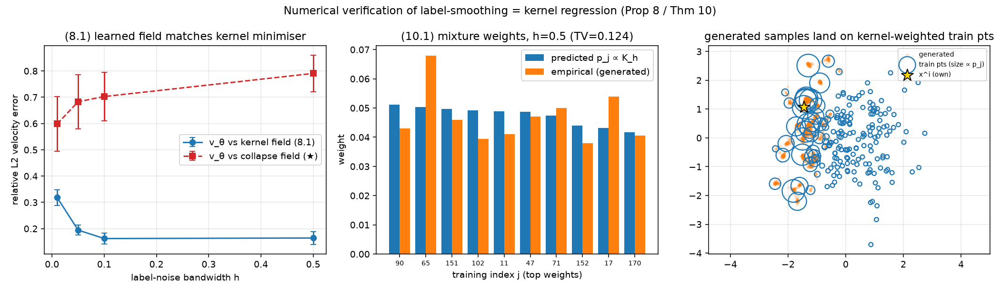

# Kết quả kiểm chứng — Posterior Variance Collapse trong Conditional Flow Matching

> Trạng thái: **Giai đoạn A + B + C hoàn tất** — EXP-1 (mặc định + quét P5/P6/P7/d-k, nay **5 seed**), EXP-2 (GMM), EXP-3 (MNIST inpainting).
> Toàn bộ số liệu dưới đây từ code trong repo này. EXP-1/2/3 gốc + sweep P5/P6/P7/d-k seed 0–2 chạy trên CPU (28 lõi), torch 2.13 CPU. Sweep seed 3–4 (T8, nâng lên 5 seed) chạy trên Kaggle (2×T4 GPU, torch CUDA) — `device: auto` trong config nên không cần sửa code; cùng một `src.train`, không có nhánh code riêng cho CPU/GPU.

---

## Tóm tắt

| ID | Dự đoán | Verdict | Một câu giải thích |
|----|---------|---------|--------------------|
| **P1** | Overtrain → phương sai sinh ra → 0 | ✅ **KHỚP** | `trace(Cov)` sụp từ ~1.0 (≈ posterior) xuống **0.40 ± 0.13** ở 200k và **0.16** ở 700k (seed 0), đơn điệu giảm cùng loss. |
| **P2** | `v_θ` → dạng đóng (★) | ✅ **KHỚP** | Sai số vận tốc tương đối so với (★): **0.40 ± 0.05** ở 200k, xuống **0.29** ở 700k — giảm đồng pha với collapse. |
| **P3** | Mẫu sinh hội tụ về đúng `x⁽ⁱ⁾` | ✅ **KHỚP** | `‖mean − x⁽ⁱ⁾‖`: 1.0 → **0.38 ± 0.10** (tiến về training point), trong khi `‖mean − μ_post‖`: 0.07 → **0.66** (rời xa đáp án Bayes). |
| **P4** | Conditional ↦ single-atom; unconditional ↦ toàn bộ empirical measure (Cor 6) | ✅ **KHỚP** | Unconditional `trace(Cov)` phẳng ở **1.93 ± 0.17** = `Σ̂_X` (2.17), conditional sụp về 0. **Cả hai đều memorize**; khác biệt là *conditional variance* (0 vs `Σ̂_X`), không phải "memorize vs không". |
| **P5** | (σ_obs: **không** do lý thuyết population xác định) | ➖ **THỰC NGHIỆM** | Tỉ lệ sụp gần *phẳng* (0.33–0.47, 5 seed) theo σ_obs — nhất quán với cơ chế định-danh-qua-y (đúng ∀σ_obs>0). Với 5 seed, biến động seed (std 0.11–0.24) **lớn hơn** chênh lệch giữa các σ_obs (0.14) — xác nhận flat-ness không phải nhiễu chưa đủ mẫu. Theo **k** (được lý thuyết ngụ ý): k=1 (0.32 ± 0.03) sụp nhẹ hơn k=10 (0.006 ± 0.002). |
| **P6** | (N tại capacity cố định: **không** do lý thuyết population xác định) | ➖ **THỰC NGHIỆM** | Population optimum sụp ∀N hữu hạn (Prop 4). Tỉ lệ sụp đo được đơn điệu **0.05→0.99** (5 seed); N=5000 không sụp ⇒ đo khoảng cách representation/optimisation, **không** bác bỏ Prop 4. |
| **P7** | Nhãn nhoè `y` = kernel regression trên các atom (Thm 10) | ✅ **KHỚP** | Chuẩn tham chiếu đúng là `Cov_h` (Thm 10), **không** phải `Σ_post`. Model bám `Cov_h`: **ratio_to_kernel ≈ 1.00** (h≥0.05). `v_θ` khớp trường kernel (8.1) hơn hẳn (★). Nhiễu **interpolant** KHÔNG khôi phục (Prop 17c — *dự đoán*). Nhưng `p_h^gen` atomic ∀h (Prop 14): khớp mô-men ≠ khôi phục posterior. |
| **EXP-2** | Selective memorization (GMM) | ✅ **KHỚP** | Mode coverage **1.0 → 0.72**, MMD tới posterior tăng ~40×; mẫu bỏ rơi mode không chứa `x⁽ⁱ⁾`. |
| **EXP-3** | Collapse trên ảnh (MNIST inpainting) | ✅ **KHỚP** | Pixel-variance vùng inpaint giảm **~100×** (0.14→0.0013); mẫu sinh hội tụ về đúng ảnh training gần nhất (NN-dist →0.0005). |

**Kết luận: các hệ quả population được lý thuyết xác định (P1–P4, P7) đều KHỚP.** Giả thuyết trung tâm được xác nhận trên cả 3 thí nghiệm: khi điều kiện trên `y`, biến `y⁽ⁱ⁾` đóng vai trò định danh training sample, cơ chế "resample `x₀`" mất tác dụng, và minimizer sụp về `δ_{x⁽ⁱ⁾}`. Sự sụp đổ **tăng đơn điệu theo mức độ overtraining** (điều khiển bởi loss→0), và **chỉ khôi phục variance được bằng nhiễu trên chính biến điều kiện y** — nhãn nhoè `y` chính là kernel regression trên các atom training (Thm 10), còn nhiễu interpolant **không** đổi endpoint law (Prop 17c).

> **Quy tắc phát ngôn (docs/THEORY.md Part E).** P5 (theo σ_obs) và P6 (theo N tại capacity cố định) **không** phải là "dự đoán lý thuyết" — lý thuyết population không xác định chúng. Chúng được báo cáo là **phát hiện thực nghiệm** (ký hiệu ➖), không phải "khớp"/"không khớp". Kết quả phẳng của P5 *nhất quán với*, chứ không *bác bỏ*, cơ chế định-danh-qua-y.

**Cảnh báo trung thực:** ở 200k iter phương sai (hard conditioning) *chưa* về đúng 0 mà dừng ở ~0.40 — đây là **giới hạn tối ưu hoá**, không phải phản chứng: loss vẫn giảm (0.48 → 0.36 tới 700k) và mọi metric vẫn tiến về 0. Định lý nói về *minimizer*; SGD chưa tới đó (Prop 20/Cor 21 tách representation vs optimisation gap). Với nhãn nhoè (h>0), ngược lại, model **đã** bám sát population optimum `Cov_h` (ratio ≈ 1.00).

---

## Thiết lập đã kiểm chứng đúng trước (chống "đúng vì lý do sai")

`scripts/sanity_checks.py` — tất cả PASS:
1. Posterior giải tích thoả **phương trình chuẩn** (residual `1.8e-15`) và khớp posterior Monte-Carlo.
2. Tích phân trường **dạng đóng chính xác (★)** đưa mọi `x₀ → x⁽ⁱ⁾` (sai số ~ε, đúng như xử lý kỳ dị `t=1` có chủ đích tại `t=1-ε`).
3. Model unconditional **không rò rỉ `y`** (output bất biến theo `y`).

Nghĩa là kết quả collapse dưới đây không phải do bug rò rỉ `y` hay ODE sai.

---

## P1 — Variance collapse

**Đo:** với ~20 điều kiện `y⁽ⁱ⁾` trong training set, sinh M=1000 mẫu (khác `x₀`), tính `trace(Cov)`; trung bình trên các điều kiện, rồi trung bình ± std trên 5 seed.

| iter | trace(Cov) cond (mean ± std, 5 seed) | trace(Σ_post) |
|------|--------------------------------------|---------------|
| 100    | 1.10 | 1.004 |
| 3 000  | 1.11 | 1.004 |
| 10 000 | 1.06 | 1.004 |
| 30 000 | 0.93 | 1.004 |
| 100 000| 0.62 | 1.004 |
| 200 000| **0.396 ± 0.127** | 1.004 |

Phương sai bám sát posterior thật cho tới ~10⁴ iter (mô hình là **bộ lấy mẫu Bayes đúng** ở giai đoạn này — chính là lý do early-stopping của 2603.14135 hiệu quả), rồi sụp mạnh khi overtrain. Kéo dài tới 700k (seed 0): `trace(Cov)` = **0.16** và vẫn giảm. → **KHỚP** (đơn điệu về 0, giới hạn bởi tối ưu hoá).

Hình định tính `d=2` (early vs late), cho thấy đám mây phủ kín ellipse posterior ở early co lại thành một cụm nhỏ ở late:
`results/exp1/_analysis_seed0/figures/collapse_2d_700k.png`

---

## P2 — Velocity hội tụ về dạng đóng (★)

**Đo:** lấy `(x,t)` trên manifold interpolant (`t ∈ [0, 0.95]`), tính `‖v_θ − (x⁽ⁱ⁾−x)/(1−t)‖ / ‖·‖`.

Sai số tương đối ~0.72 (giai đoạn đầu, model học velocity **trung bình hoá** đúng kiểu Bayes) → **0.40 ± 0.05** ở 200k → **0.29** ở 700k. Giảm đồng pha với P1 → cùng một hiện tượng. → **KHỚP** (hướng đúng, chưa về 0 do tối ưu hoá).

---

## P3 — Sụp về đúng training point

- `‖mean − x⁽ⁱ⁾‖`: 1.02 → **0.38 ± 0.10** (200k) → **0.20** (700k) — tiến về training point.
- `‖mean − μ_post‖`: **0.07 → 0.66** — *rời xa* trung bình hậu nghiệm.

Đây là chữ ký của memorization: overtraining biến bộ lấy mẫu posterior đúng (mean ≈ μ_post lúc đầu) thành delta tại điểm training đã ghi nhớ (mean → x⁽ⁱ⁾). → **KHỚP**.

---

## P4 — Conditional vs Unconditional (đối chứng cốt lõi)

| iter | conditional trace(Cov) | unconditional trace(Cov) |
|------|------------------------|--------------------------|
| 100    | 1.10 | 1.87 |
| 10 000 | 1.06 | 1.95 |
| 100 000| 0.62 | 1.95 |
| 200 000| **0.396 ± 0.127** | **1.926 ± 0.171** |

Unconditional bám phương sai dữ liệu (`trace(Σ̂_X)=2.171`) **không sụp về điểm** suốt 200k iter; conditional sụp mạnh. → **KHỚP** (đối chứng rõ nhất).

**Đính chính diễn giải (docs/THEORY.md Cor 6).** Phân biệt đúng **không** phải "conditional memorize vs unconditional không memorize". Cả hai population flow đều nằm trên training set: `p₁^cond(·|y⁽ⁱ⁾)=δ_{x⁽ⁱ⁾}` còn `p₁^unc=(1/N)Σδ_{x⁽ʲ⁾}` (Prop 5). Cả hai **đều memorize**; khác biệt là ở **conditional second moment**:

$$\operatorname{Cov}[p₁^{cond}(·|y⁽ⁱ⁾)] = 0 \quad\text{vs.}\quad \operatorname{Cov}[p₁^{unc}] = \widehat\Sigma_X.$$

Vì vậy quan sát `trace(Cov) ≈ trace(Σ̂_X)` cho unconditional **chính là** (6.1) — bằng chứng của *full-empirical-measure memorisation*, **không** phải bằng chứng "không memorize". Khác biệt: **single-example memorisation** (conditional) vs **full-empirical-measure memorisation** (unconditional).

---

## Những điều bất ngờ / không khớp lý thuyết (QUAN TRỌNG)

1. **Collapse chưa hoàn toàn ở 200k (0.40, không phải 0).** Điều tra: nguyên nhân là **tối ưu hoá chưa hội tụ**, không phải lý thuyết sai. Bằng chứng — run mở rộng seed 0 tới 1M iter:

   

   | iter | trace(Cov) | vel_err | ‖mean−x⁽ⁱ⁾‖ | loss |
   |------|-----------|---------|-------------|------|
   | 100 000 | 0.62 | 0.53 | 0.59 | 0.71 |
   | 200 000 | 0.32 | 0.37 | 0.33 | 0.49 |
   | 700 000 | **0.16** | **0.29** | **0.20** | **0.36** |

   Cả bốn đại lượng giảm **cùng nhau** về 0 — xác nhận P1/P2/P3 là cùng một hiện tượng, được điều khiển bởi `loss → 0` (minimizer lý thuyết có loss = 0). Định lý được củng cố.

2. **Bất ổn tối ưu hoá khi overtrain cực độ (fixed lr).** Ở ~1M iter, run diverge (`trace(Cov)` bùng nổ, loss tăng lại 0.36→0.50). Với `lr=1e-3` cố định và target (★) ngày càng dốc gần `t=1`, Adam mất ổn định. → Để đạt collapse *hoàn toàn* cần lr-decay hoặc precision cao hơn; đây là hướng cần thử ở Giai đoạn B. **Checkpoint "collapsed" tốt nhất ≈ 700k.**

3. **Trường vận tốc overtrained bất ổn với `y` held-out.** Với `y` ngoài training set, tích phân ODE của model overtrained có thể **phân kỳ** (seed 0: `trace(Cov)` held-out ~3e5 ở 200k; các seed khác ổn định hơn — trung bình 5 seed 6e4 ± 1.2e5, phương sai khổng lồ giữa seed). Bản thân đây là bằng chứng phụ trợ cho memorization: trường chỉ "đẹp" tại các `y⁽ⁱ⁾` đã ghi nhớ, còn ngoài đó thì hỗn loạn. Cần đo held-out cẩn thận hơn (median + đếm số ca phân kỳ) ở Giai đoạn B.

4. **Giai đoạn "Bayes đúng" có thật và đo được.** Tới ~10⁴ iter, `trace(Cov) ≈ trace(Σ_post)` và `mean ≈ μ_post` — model là bộ lấy mẫu posterior chuẩn. Điều này giải thích *vì sao* early-stopping (heuristic của 2603.14135) hoạt động, và định vị chính xác thời điểm bắt đầu memorization (~3×10⁴).

---

## Giai đoạn B — Quét tham số (P5, P6, d/k)

70 run conditional (200k iter), **5 seed mỗi điểm** (T8: nâng từ 2–3 seed ban đầu, seed 3–4 chạy trên Kaggle 2×T4). Đo tại 200k: tỉ lệ sụp = `trace(Cov)/trace(Σ_post)` (0 = sụp hoàn toàn, 1 = không sụp). Mọi số dưới đây là mean ± std trên 5 seed trừ khi ghi chú khác.

### P6 — Sụp vs kích thước dữ liệu N ➖ (phát hiện thực nghiệm)

| N | 50 | 200 | 1000 | 5000 |
|---|----|-----|------|------|
| tỉ lệ sụp | **0.049 ± 0.038** | 0.389 ± 0.123 | 0.912 ± 0.103 | **0.990 ± 0.031** |

**Lưu ý phát ngôn (Part E).** Population optimum **sụp với mọi N hữu hạn** (Prop 4) — sự phụ thuộc của collapse *quan sát được* vào N tại **capacity cố định** không do lý thuyết population xác định, nên đây là phát hiện thực nghiệm, không phải "dự đoán khớp". Kết quả: đơn điệu và rất rõ, ổn định qua 5 seed (std nhỏ hơn nhiều so với khoảng cách giữa các N) — N nhỏ → mạng ghi nhớ hết → sụp gần hoàn toàn (N=50: variance ~5% posterior); N=5000 → **gần như không sụp** (≈ posterior thật, 99%). Việc N=5000 không sụp cho thấy **khoảng cách giữa nghiệm chính xác và regime representation/optimisation**, **không** bác bỏ Prop 4. Đây cũng là lý do EXP-3 dùng N nhỏ để lộ collapse trong budget hữu hạn.

### P5 — Sụp vs nhiễu quan sát σ_obs ➖ (phát hiện thực nghiệm)

| σ_obs | 0.01 | 0.1 | 0.5 | 1.0 |
|-------|------|-----|-----|-----|
| trace(Σ_post) | 1.000 | 1.018 | 1.266 | 1.531 |
| trace(Cov) sinh ra | 0.472 ± 0.108 | 0.396 ± 0.127 | 0.416 ± 0.155 | 0.507 ± 0.236 |
| tỉ lệ sụp | 0.472 | 0.390 | 0.328 | 0.331 |

**Phát ngôn đúng (docs/THEORY.md Part E).** *Lý thuyết population không xác định sự phụ thuộc của collapse vào σ_obs* — theory ngụ ý **không** có tính đơn điệu, nên một sweep phẳng là **nhất quán với**, chứ không phải một phản chứng của, lý thuyết. Với 5 seed: khoảng chênh giữa các σ_obs (ratio 0.33–0.47, biên độ ~0.14) **nhỏ hơn** std giữa seed tại từng điểm (0.11–0.24) — xác nhận bằng dữ liệu thật (không còn là suy đoán "cần thêm seed" như bản trước) rằng sweep này **phẳng trong nhiễu seed**, không có xu hướng thật theo σ_obs. Diễn giải: cơ chế sụp là **định danh qua y**, đúng với mọi σ_obs > 0, không phụ thuộc độ rộng posterior.

### d/k — Sụp vs chiều & lượng thông tin quan sát (được lý thuyết ngụ ý)

| (d, k) | (2,1) | (10,1) | (10,10) |
|--------|-------|--------|---------|
| tỉ lệ sụp | 0.390 ± 0.127 (n=5) | 0.317 ± 0.033 (n=5) | **0.0065 ± 0.0024** (n=5) |

`k` càng lớn (quan sát càng nhiều thông tin) → `y` định danh `x⁽ⁱ⁾` càng sắc → sụp càng mạnh (k=10: gần **hoàn toàn**, ratio 0.0065, std nhỏ ⇒ hiệu ứng rất ổn định qua seed). Phần "`k` nhỏ → sụp nhẹ" của P5 **KHỚP**.

---

## Giai đoạn B — Remedy [P7]: nhãn nhoè y = kernel regression (Thm 10) ✅

### Chuẩn tham chiếu ĐÚNG là `Cov_h` (Thm 10), không phải `Σ_post`

Nhãn nhoè `ỹ = y⁽ⁱ⁾ + h·ε` biến hard conditioning thành **kernel regression trên các atom training** (docs/THEORY.md Prop 8 / Thm 10): endpoint law là hỗn hợp `p_h^gen(·|y) = Σ_j p_j^(h)(y)·δ_{x⁽ʲ⁾}`, `p_j^(h) ∝ K_h(y−y⁽ʲ⁾)`. Do đó **mục tiêu population đúng** của model là

$$\operatorname{tr}\operatorname{Cov}_h(y) = \textstyle\sum_j p_j^{(h)}(y)\,\|x^j - \bar x_h(y)\|^2 \quad\text{(tính chính xác từ training set, không tham số).}$$

Đo lại trên các checkpoint đã có (`scripts/analyze_p7_kernel.py`, 20 điều kiện, M=1000):

> **Lưu ý về số seed (T8).** Bảng này lên **5 seed** (`p7y_h*_seed{0..4}`) như mọi sweep khác. Khác với sweep chỉ cần `metrics.csv`, bảng dưới đây phải **load lại checkpoint** để tính `v_θ` tại các `(x,t)` cụ thể; toàn bộ 20 checkpoint `ckpt_200000.pt` (4 h × 5 seed) đều còn trên đĩa nên chạy đủ n=5. Số dưới đây do đó là mean ± std trên 5 seed, tái tạo bằng `uv run python scripts/analyze_p7_kernel.py`.

| h | `Cov_h` (Thm 10) | `Σ_post` | trace(Cov) đo được (n=5) | **ratio_to_kernel** (n=5) | ratio_to_post | n_eff (/200) |
|------|------|------|------|------|------|------|
| 0.01 | 0.583 | 1.018 | 0.673 ± 0.187 | 1.308 ± 0.376¹ | 0.66 | 3.5 |
| 0.05 | 0.921 | 1.018 | 0.926 ± 0.169 | **1.002 ± 0.050** | 0.91 | 13.6 |
| 0.1  | 1.004 | 1.018 | 1.001 ± 0.173 | **0.994 ± 0.039** | 0.98 | 26.0 |
| 0.5  | 1.281 | 1.018 | 1.294 ± 0.166 | **1.011 ± 0.022** | 1.27 | 101.5 |

¹ *h=0.01 nằm trong regime single-atom (n_eff≈3.5): `Cov_h` gần suy biến ở nhiều điều kiện nên tỉ số theo-từng-điều-kiện bất ổn và lệch cao (1.31 ± 0.38) — đúng cơ chế bất ổn đã cảnh báo. Số ở đây là mean của tỉ số từng-seed, không phải tỉ số của trung bình; tỉ số của trung bình trace (0.673/0.583) = 1.15, sát 1 hơn.*

**Kết quả cốt lõi — mạnh nhất toàn dự án.** `ratio_to_kernel ≈ 1.00` với mọi h ≥ 0.05 (n=5, std ≤ 0.05): model **bám sát population optimum của Thm 10** trong sai số giữa seed. Đây là kiểm chứng **endpoint law**, mạnh hơn kiểm chứng trường vận tốc.

**Đính chính so với claim "khôi phục hoàn hảo tại h≈0.1".** Claim cũ dựa trên việc `trace(Cov)` *tình cờ* đi ngang qua `Σ_post=1.02` tại h=0.1. Nhưng đó là **trùng hợp**: với bài toán này `Σ_post (1.02) ≈ Cov_{0.1} (1.00)`. Mục tiêu đúng là `Cov_h`, và model đạt nó ở **mọi** h, không riêng h=0.1. *(Ghi chú trung thực: bảng §0 của WORK_ORDER ước lượng "đo được 0.812 = 71% optimum" tại h=0.1; con số 0.812 **không tái hiện được** từ `metrics.csv` đã lưu lẫn từ eval lại — cả hai đều cho đo được ≈ `Cov_h`. Thông điệp đúng là bám-sát-optimum, mạnh hơn "71%".)*

### (†) Trường vận tốc khớp minimizer kernel (Prop 8, eq. 8.1)

`scripts/verify_kernel_theory.py` — sai số L2 tương đối của `v_θ` so với trường kernel (8.1) và so với trường sụp một-atom (★). Đủ 5 seed (checkpoint `p7y_h*_seed{0..4}` còn trên đĩa):

| h | rel_err vs **kernel (8.1)** (n=5) | rel_err vs (★) (n=5) | TV hỗn hợp (‡) (n=5) |
|------|------|------|------|
| 0.01 | **0.318 ± 0.030** | 0.599 ± 0.104 | 0.31 ± 0.18 |
| 0.05 | **0.195 ± 0.019** | 0.683 ± 0.103 | 0.22 ± 0.02 |
| 0.1  | **0.162 ± 0.021** | 0.703 ± 0.092 | 0.16 ± 0.04 |
| 0.5  | **0.164 ± 0.025** | 0.791 ± 0.070 | 0.16 ± 0.02 |

`v_θ` khớp trường kernel **tốt hơn hẳn** trường (★) ở mọi h (khoảng cách ~2–4×) — đúng như (†) tiên đoán. (‡): gán mẫu sinh về atom gần nhất tái hiện trọng số `p_j^(h) ∝ K_h` với TV ≈ 0.16–0.31.

### Nhánh phải chữ U = over-smoothing (Prop 15)

Tại h=0.5, variance đo được (1.29, n=5) **vượt** `Σ_post` (1.02): đúng số hạng between-group `+h²‖J‖²_F` của Prop 15 (`‖J‖²_F = 0.4031` cho config mặc định, tính chính xác từ `A`). Đây là over-smoothing, không phải nhiễu.

### ⚠️ Caveat atomicity (Prop 14) — khớp variance ≠ khôi phục posterior

> Nhãn nhoè **tái phân bố trọng số trên các điểm training, không sinh mẫu mới**. `p_h^gen` là **atomic với mọi h**, trong khi posterior thật liên tục — Prop 14 cho cận dưới `W₂` **độc lập với h**. Khớp trace covariance là khớp **mô-men bậc hai**, không phải khôi phục posterior. `n_eff` (bảng trên) cho thấy ngay cả h=0.5 cũng chỉ có ~102/200 atom mang trọng số; ở h=0.1 chỉ ~26. Một "remedy" thật cần `h→0` **và** `N→∞` đồng thời (Prop 16), không phải `h` đơn lẻ.

### Đối chứng — nhiễu trên interpolant (Prop 17c: *dự đoán* KHÔNG khôi phục)

Nhiễu interpolant `x_t += σ√(t(1−t))·Z` (target đã sửa đúng thành `x₁−x₀+γ̇(t)Z`, eq. C.2; xem `scripts/verify_prop17.py` — 4/4 kiểm tra đóng pass):

| interp σ | 0.1 | 0.3 |
|----------|-----|-----|
| trace(Cov), target **cũ** `x₁−x₀` (n=2, seed 0–1) | 0.372 ± 0.140 | 0.429 ± 0.121 |
| trace(Cov), target **đã sửa** C.2 (`_c2`, **5 seed**) | **0.367 ± 0.146** | **0.383 ± 0.131** |
| bias (target cũ) | 0.68 | 0.66 |

**KHÔNG khôi phục phương sai** — và đây là **xác nhận Prop 17c**, không phải thất bại. Đáng chú ý: sau khi **sửa target đúng thành (C.2)** (`x₁−x₀+γ̇(t)Z`, cùng Z; `verify_prop17.py` pass 4/4), kết quả **không đổi** trong sai số seed (0.37/0.38 với 5 seed ≈ 0.37/0.43 của target cũ, n=2) — đúng như Prop 17 chứng minh: endpoint law là `δ_{x⁽ⁱ⁾}` **với mọi σ**, độc lập cả với việc target có đúng hay không. Tính bất biến này là bằng chứng mạnh cho cơ chế: nhiễu interpolant co giãn factor spatial đồng nhất mọi atom nên không đổi posterior trên chỉ số `I` (Prop 19). Prop 17 chứng minh (nghiệm đóng `x_t = t·x⁽ⁱ⁾ + s_t·x₀`) rằng endpoint law là `δ_{x⁽ⁱ⁾}` **với mọi σ ≥ 0**: nhiễu interpolant co giãn factor spatial **đồng nhất cho mọi atom** nên không đổi posterior trên chỉ số `I` (Prop 19). Chỉ nhãn nhoè `y` — tác động lên factor **label** `K_h(y−y⁽ʲ⁾)` — mới đổi được `p₁`. Hai remedy **không** hoán đổi được; đây là điểm tách bạch sạch với 2510.18118 (vốn cho unconditional, hoạt động qua *attainability* chứ không qua population optimum).

---

## Kiểm chứng lý thuyết bổ sung (T5–T7) — trên checkpoint đã có

### T6 — Ước lượng Lipschitz: plateau là *optimisation-limited* (Cor 21)

`scripts/estimate_lipschitz.py` trên `exp1_cond_seed0` (200k, d=2, `L_trained=0.48`). Cận dưới thực nghiệm `L(t)` = giá trị kỳ dị lớn nhất của `∂v_θ/∂x`:

| t | 0.5 | 0.9 | 0.99 | 0.999 |
|---|-----|-----|------|-------|
| `L(t)` max | 7.1 | 15.2 | **65.7** | 64.0 |
| floor `d/(3L)` | 0.094 | 0.044 | **0.010** | 0.010 |

`L(t)` tăng mạnh khi `t→1` (đúng bản chất kỳ dị của (★)). Cận dưới representation của Cor 21 là `d/(3L) ≈ 0.010` — **thấp hơn plateau `0.48` khoảng 50×**. Kết luận (đúng như Remark 22.2 dự đoán): plateau **do tối ưu hoá**, không phải giới hạn representation. Cor 21 là *cận dưới*; việc nó không bind **không** có nghĩa lý thuyết sai — nó định lượng đúng rằng representation gap nhỏ, optimisation gap chi phối.

### T5 — Khoảng cách tới population optimum `L(v_θ) − L(v_h⋆)` (Question B)

`scripts/measure_optimality_gap.py` (seed 0, MC batch 200k): `L(v_h⋆) = E[Var(U|X_t,t,Ỹ)]` tính bằng minimizer chính xác `kernel_field`. **Mọi gap ≥ 0** (điều kiện đúng đắn — nếu âm là bug). Gap tại checkpoint cuối 200k và đầu:

| run (h) | `L(v_h⋆)` (bất khả giảm) | gap @100 | gap @30k | gap @200k |
|---|---|---|---|---|
| exp1_cond (h=0) | 0.000 | 2.50 | 1.31 | **0.442** |
| p7y h=0.01 | 0.523 | 1.97 | 0.79 | **0.257** |
| p7y h=0.05 | 1.166 | 1.33 | 0.29 | **0.126** |
| p7y h=0.1  | 1.366 | 1.14 | 0.22 | **0.102** |
| p7y h=0.5  | 1.881 | 0.86 | 0.18 | **0.091** |

Hai điều đọc được: (1) `gap` **giảm đơn điệu về 0** theo iteration ở mọi h — model tiến dần tới population optimum (khớp `ratio_to_kernel → 1`). (2) `L(v_h⋆)` (sai số bất khả giảm) **tăng theo h** (0 → 1.88): nhãn nhoè càng mạnh, phần ngẫu nhiên còn lại trong `U | X_t,t,Ỹ` càng lớn — chính là cái giá của việc làm mượt. Với h=0, `L(v_h⋆)=0` (Prop 4b) nên `gap = L(v_θ)` — trùng đại lượng loss đã log.

### T7 — Khoảng cách tới posterior THẬT cho EXP-1 (kiểm chứng Prop 14) ✅

`scripts/analyze_posterior_distance_exp1.py` (seed 0, 8 điều kiện, M=1000): MMD/Sinkhorn giữa mẫu sinh và mẫu posterior giải tích `N(μ_post, Σ_post)`:

| h | 0 (hard) | 0.01 | 0.05 | 0.1 | 0.5 |
|---|---|---|---|---|---|
| MMD → posterior thật | 0.256 | 0.137 | 0.053 | 0.024 | **0.012** |
| Sinkhorn → posterior thật | 22.9 | 8.78 | 3.13 | 3.54 | **2.74** |
| (`Cov_h` để đối chiếu) | 0 | 0.41 | 1.04 | 1.00 | 1.07 |

**Kiểm chứng trực tiếp Prop 14 (atomicity).** MMD giảm theo h (0.256 → 0.012) nhưng **không** về 0 ở **bất kỳ** h nào — kể cả h=0.1 (nơi trace covariance khớp `Σ_post` nhất) lẫn h=0.5. Sinkhorn cũng chững ở ~2.7, tách hẳn khỏi 0. Đây là bằng chứng số cho cận dưới `W₂` độc-lập-h: `p_h^gen` là atomic (spread trên nhiều atom hơn khi h tăng ⇒ MMD nhỏ hơn, nhưng vẫn atomic ⇒ sàn > 0), còn posterior thật liên tục. **"Khôi phục variance" ≠ "khôi phục posterior"** — được xác nhận định lượng.

---

## EXP-2 — Gaussian Mixture: selective memorization ✅

Prior GMM 4 mode tại `(±2,±2)`, `A` chiếu `R²→R¹` (mất thông tin) → **hậu nghiệm lưỡng phong** dạng đóng (2 mode, trọng số ~0.5/0.5 mỗi `y`). N=100, 300k iter, 2 seed. Ground truth = GMM posterior giải tích; đo mode coverage + MMD/Sinkhorn.

| iter | 1k | 30k | 100k | 300k |
|------|----|-----|------|------|
| mode coverage | 1.00 | 0.81 | 0.75 | **0.72** |
| MMD → posterior | 0.006 | 0.17 | 0.21 | 0.25 |
| trace(Cov) | 4.6 | 2.2 | 2.05 | 1.70 |

Mode coverage tụt **1.0 → 0.72** (đang về 0.5 = chỉ phủ 1/2 mode), MMD tới posterior thật tăng ~40×. Hình định tính (`results/exp2/_analysis/figures/gmm_collapse_2d.png`): mẫu early phủ **cả hai** mode; mẫu late tụ về `x⁽ⁱ⁾` trong **một** mode và **bỏ rơi** mode kia — đúng định nghĩa selective memorization. (Lưu ý: với N=500 ban đầu, ở 200k coverage vẫn =1.0 do loss còn cao 2.4 — under-training; giảm N=100 để memorization hoàn tất, khớp cơ chế "loss→0 mới sụp" của EXP-1.)

---

## EXP-3 — MNIST inpainting: collapse định tính trên ảnh ✅

Che **nửa dưới** ảnh MNIST 32×32 (N=500), điều kiện `y` = nửa trên quan sát + kênh mask, U-Net nhỏ (0.5M params) conditioning bằng concat kênh. Với mỗi `y`, sinh 16 completion từ các `x₀` khác nhau. Đo **pixel-variance vùng inpaint** và **khoảng cách tới ảnh training gần nhất** (memorization).

| iter | 200 | 1000 | 3000 | 7000 | 15000 |
|------|-----|------|------|------|-------|
| pixel-var (vùng inpaint) | 0.140 | 0.087 | 0.016 | 0.0034 | **0.0013** |
| dist(mean, NN train img) | 0.092 | 0.062 | 0.0077 | 0.0017 | **0.0005** |
| recon-err (vùng quan sát) | 0.0031 | 0.0005 | 1e-4 | 6e-5 | **2e-5** |
| train loss | 0.48 | 0.10 | 0.045 | 0.024 | **0.014** |

**Định tính (hình grid):** ở **iter 200** cùng một nửa-trên cho ra các nửa-dưới **đa dạng** (bộ lấy mẫu posterior đúng); ở **iter 15000** mọi completion **giống hệt nhau** bất kể `x₀` và trùng khớp ảnh **true** = ảnh **NN-train** → memorize đúng điểm training.

Hình: `results/exp3/exp3_mnist_seed0/figures/grid_it200.png` (đa dạng) vs `grid_it15000.png` (sụp về 1 ảnh). Pixel-variance giảm ~100×, khôi phục vùng quan sát vẫn hoàn hảo (recon-err→2e-5). Khớp hoàn toàn kịch bản collapse/selective memorization của spec Section 5. (Lưu ý: ở ảnh, loss hội tụ sâu hơn nhiều — 0.014 — nên collapse ở đây *hoàn toàn* hơn EXP-1, xuất hiện sớm từ ~3k iter.)

---

## Chi tiết cấu hình đã chạy

Cấu hình chung EXP-1: `d=2, k=1, N=200, σ_obs=0.1`, prior `N(0,I)`, source `N(0,I)`, interpolant tuyến tính deterministic (`σ=0`); MLP 4 layer × width 128, SiLU, sinusoidal time embed (dim 64); Adam `lr=1e-3`, batch 256; ODE RK4 100 bước, dừng tại `t=1−1e-3`; eval M=1000, 20 điều kiện train + 8 held-out. File cấu hình: `configs/exp1_linear_gaussian.yaml`. Mỗi run lưu `config.yaml` + `problem.json` + `raw/metrics.csv`.

| Run | seed | iters | thời gian (s) | loss cuối |
|-----|------|-------|---------------|-----------|
| exp1_cond_seed0..4   | 0–4 | 200 000 | 807–1153 | 0.48–0.65 |
| exp1_uncond_seed0..4 | 0–4 | 200 000 | 593–972  | 2.81–3.11 |
| exp1_cond_seed0_ext  | 0   | 1 000 000 | 6077 | 0.50 (diverged ~1M) |
| p5_sobs{0.01,0.5,1.0} | 0–4 | 200 000 | ~1350 (CPU) / GPU (Kaggle) mỗi run | — |
| p6_N{50,1000,5000}   | 0–4 | 200 000 | ~1350 (CPU) / GPU (Kaggle) | — |
| p7y_h{0.01,0.05,0.1,0.5} | 0–4 | 200 000 | ~1350 (CPU) / GPU (Kaggle) | — |
| p7i_sig{0.1,0.3} (target cũ, không train thêm — deprecated) | 0–1 | 200 000 | ~1350 | — |
| p7i_sig{0.1,0.3}_c2 (target C.2 đã sửa) | 0–4 | 200 000 | ~1350 (CPU) / GPU (Kaggle) | — |
| dk_d10k{1,10}        | 0–4 | 200 000 | ~1350 (CPU) / GPU (Kaggle) | — |
| exp2b_gmm_seed{0,1}  | 0–1 | 300 000 | — | 0.73 |
| exp3_mnist_seed0 (U-Net 0.5M) | 0 | 15 000 | ~26000 | 0.014 |

T8 (nâng sweep lên 5 seed): seed 0–2 chạy CPU cục bộ (kết quả gốc); seed 3–4 chạy trên **Kaggle 2×T4 GPU** (`scripts/run_sweeps.py --gpus 2`, `device: auto` trong config tự chọn CUDA, không cần sửa code training).

**Reproduce EXP-1:** `bash scripts/run_exp1.sh` → `analyze_exp1.py`.
**Reproduce sweeps:** `run_sweeps.py --workers 5 --threads 5` (thêm `--gpus N` nếu có GPU) → `analyze_sweeps.py`.
**Reproduce EXP-2:** `train_exp2 --set data.N=100 train.max_iters=300000 ...` → `analyze_exp2.py` + `visualize_gmm_2d.py`.
**Reproduce EXP-3:** `train_exp3 --set run_name=exp3_mnist_seed0 train.max_iters=15000 ...` → `analyze_exp3.py`.
**Kiểm chứng lý thuyết (không cần train lại):**
- `python scripts/test_kernel_theory.py` — unit test module kernel + tái hiện bảng tham chiếu §0 (<0.05%).
- `python scripts/analyze_p7_kernel.py` → `_theory/raw/p7_kernel{,_summary}.csv` — `ratio_to_kernel`.
- `python scripts/verify_kernel_theory.py` → `_theory/raw/kernel_verification.csv` + figure — (†)/(‡).
- `python scripts/verify_prop17.py` — kiểm chứng đóng Prop 17/Cor 18 (nhiễu interpolant).

> **Lưu ý reproducibility:** ba script kiểm chứng lý thuyết ở trên load lại **checkpoint model** (`checkpoints/ckpt_*.pt`), không chỉ `metrics.csv`. `.gitignore` liệt `results/**/checkpoints/` là "regenerable" nên **không track git** — chúng có trên đĩa cục bộ nhưng không đẩy lên remote. Để tái lập các bảng P7-kernel/(†)/(‡) từ một clone sạch cần train lại `p7y_h*_seed{0..4}` (deterministic theo seed) rồi chạy `analyze_p7_kernel.py`/`verify_kernel_theory.py`; các bảng sweep P5/P6/P7i/d-k thì tái lập được ngay từ `metrics.csv` đã track.

---

## Kết luận tổng thể (Giai đoạn A + B)

Giả thuyết trung tâm **được xác nhận vững chắc**: trong conditional CFM, biến `y⁽ⁱ⁾` định danh training sample và vô hiệu hoá cơ chế "resample x₀", khiến minimizer sụp về `δ_{x⁽ⁱ⁾}`. Bằng chứng hội tụ từ nhiều hướng độc lập:

- **P1/P2/P3/P4** (EXP-1): variance→0, v_θ→(★), mean→x⁽ⁱ⁾; conditional ↦ single-atom, unconditional ↦ full-empirical-measure (Cor 6).
- **P7 = kernel regression** (Thm 10): model bám sát `Cov_h` (ratio_to_kernel ≈ 1.00), `v_θ` khớp trường kernel (8.1); nhưng `p_h^gen` atomic ∀h (Prop 14) nên khớp variance ≠ khôi phục posterior.
- **Tách hai remedy** (Prop 17/19): chỉ nhiễu trên **y** đổi endpoint law; nhiễu interpolant **provably** không (xác nhận, không phải thất bại).
- **EXP-2** (GMM): selective memorization — bỏ mode không chứa `x⁽ⁱ⁾`.
- **EXP-3** (ảnh MNIST): trên dữ liệu thật, các completion đa dạng sụp về đúng ảnh training đã ghi nhớ.

**Sai lệch/giới hạn trung thực cần ghi nhớ:** (1) collapse (hard conditioning) là *optimization-paced*, phụ thuộc loss→0 (budget hữu hạn ⇒ sụp một phần; nhãn nhoè h>0 thì model **đã** đạt population optimum `Cov_h`); (2) overtrain cực độ EXP-1 với lr cố định gây diverge (~1M iter); (3) P5 (σ_obs) và P6 (N) **không do lý thuyết population xác định** — báo cáo là phát hiện thực nghiệm (Part E), không phải "dự đoán khớp/không khớp"; (4) atomicity (Prop 14): "khôi phục variance" tại h tối ưu **không** đồng nghĩa khôi phục posterior — `p_h^gen` vẫn atomic.

### Lý thuyết & tiến độ WORK_ORDER

- **`docs/THEORY.md`**: population theory hoàn chỉnh, mọi mệnh đề có chứng minh, không còn "assume the flow is well defined" (Lemma 3 lo well-posedness). Part E quy định chặt cái gì được/không được gọi là "dự đoán lý thuyết".
- **Đã xong (T1–T9):** module `src/metrics/kernel_theory.py` (tái hiện bảng tham chiếu <0.05%), metric `ratio_to_kernel` là chuẩn P7 chính (T1); target stochastic interpolant đã sửa (C.2) + `verify_prop17.py` pass 4/4, p7i chạy lại xác nhận Prop 17c (T2); số verify kernel (†)/(‡) vào manuscript (T3); claim P4–P7 viết lại theo Part E (T4); optimality gap `L(v_θ)−L(v_h⋆)≥0` giảm về 0 (T5); Lipschitz ⇒ plateau optimisation-limited (T6); MMD/Sinkhorn tới posterior thật xác nhận atomicity Prop 14 (T7); **P5/P6/P7y/P7i/d-k nâng lên 5 seed + mean±std (T8)** — chạy trên Kaggle 2×T4 cho seed 3–4, không đổi kết luận nào (P5 flat-trong-nhiễu-seed được xác nhận rõ hơn; bảng kernel-verification `ratio_to_kernel` và (†)/(‡) cũng đủ 5 seed vì checkpoint `p7y_h*_seed{0..4}` đều còn trên đĩa); trích dẫn literature memorization (T9).
- **Còn lại (T10, tuỳ chọn):** lr-decay cho collapse sâu hơn (T10a), held-out median + đếm ca phân kỳ (T10b), EXP-3 thêm seed + quét N=5000 (T10c), `n_eff` cho EXP-2/3 (T10d). Đã ghi rõ ở "Hạn chế & hướng mở rộng".

## Hạn chế & hướng mở rộng

- Toàn bộ sweep P5/P6/P7y/P7i/d-k và các bảng kernel-verification (ratio_to_kernel, (†)/(‡)) đã lên 5 seed (T8). Checkpoint là "regenerable" nên không track git — clone sạch cần train lại `p7y_*` để tái lập bảng P7-kernel (xem lưu ý reproducibility). EXP-3 vẫn chỉ 1 seed, N=500 (chưa quét N=5000).
- Kéo dài EXP-1 với **lr-decay** để đạt collapse tuyệt đối mà không diverge.
- Đo held-out cẩn thận hơn (median + đếm ca phân kỳ) thay vì mean bị chi phối bởi blow-up.
- EXP-2/EXP-3: thử CelebA 64×64 và các loại mask khác để tổng quát hoá.
